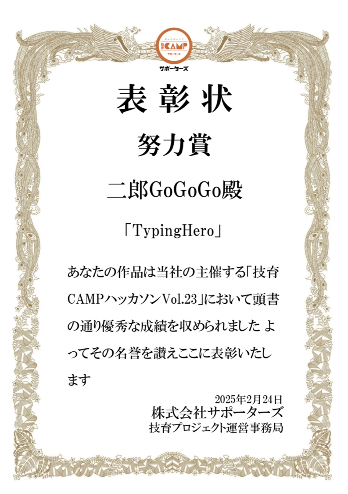

# タイピングヒーロー

## 概要
「タイピングヒーロー」は、**技育CAMPハッカソン Vol.23（主催：株式会社サポーターズ）**にて制作した、RPG型タイピングゲームです。初めてのハッカソン参加ながら、**努力賞を受賞**しました。

## 特徴
- タイピング操作で敵を倒すアクション型タイピングゲーム
- 演出・効果音などUIにこだわった設計
- 初心者でも楽しめるテンポと難易度

## 自分の担当
- UI設計（ボタン、効果音、BGM、シーン切り替えなど）
- プレゼン資料作成
- チーム代表として発表を担当

## 使用技術
- Unity（Unity Version Controlによる共同開発）
- C#
- googleスライド（資料作成）
- ChatGPT(キャラのイラスト作成）

## プレゼン資料・紹介動画
- [プレゼンスライドはこちら](https://docs.google.com/presentation/d/1sltSnanSDDQJQiWUmmAtSSk92EcbNvtpqkchCCC729k/edit?usp=sharing)

## コード非公開の理由
本プロジェクトは**Unity Version Controlを利用してチームで共同開発**しており、リポジトリ容量が非常に大きくなってしまったため、GitHubへのアップロードが難しい状況です。加えて、チーム開発物であるため、現時点ではソースコードの公開を控えています。

## 受賞歴
- **技育CAMPハッカソン Vol.23 努力賞**（2025年2月24日）

## 表彰状

## 補足
このプロジェクトは、私にとって初めてのハッカソン参加経験であり、限られた時間の中で**チーム開発・UI実装・発表までやり遂げた貴重な経験**です。
